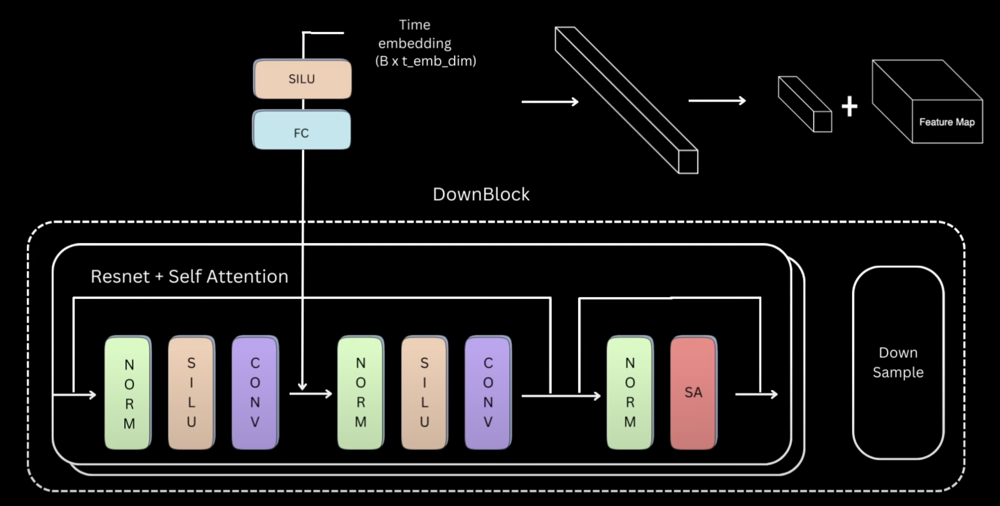

# DDPM-Implementation
This implementation of Denoising Diffusion Probabilistic Models (DDPM) in PyTorch from scratch focuses on building and training a generative model using the diffusion process. The code leverages the power of neural networks to model the reverse diffusion process, gradually denoising data to generate high-quality samples. The approach covers essential aspects of DDPM, such as the forward and reverse processes, loss function, and network architecture, providing a hands-on understanding of how diffusion models work. The implementation is designed to be easily customizable and can be used for various generative tasks, such as image Generation.

### 1. Step 1 is to create the Noise Scheduler
    Noise Scheduler has basicaaly 2 functions, first is to add Noise to the Given Image at Time t and 
    the next step is to remove the Noise at time Step t, all the functionality in this functions are
    just computation of Formulas, make sure you get the formula from the research paper of DDPM Implementation.

### 2. Step 2 Time Embedding
    Basically here in we give an input of 1-d batch_size of time t and get an output of (batch_size, time_embedding)
    This is time embedding Block converts the integer time stamp to positional embeddings using the sinusodial formula
    of sine and cosine, sine for od positions and cosine for even positions, which is followed by a fully connected layer and then a SILU(Sigmoid Linear Unit) activation. Which is again then bypassed to a FC layer resulting the Time Embedding. 

### 3. Model
    We use UNet Model, consisting of Downsampling block which decreases the image resolution by increasing the channel, 
    followed by the Mid Block, and then the Upsampling Block which upsamples the image and at the end matches the same
    size of the initial Input Image. The Unet are also connected via the Residual Blocks or(Skip Connections).

    DownSampling
    - All the DownSampling Block consists of a ResNet Block, Self Attention and a DownSample Layer
    - Block Representaion
        phase 1
        Step 1: Group Norm, followed by SILU Activation, which is then followed by ConvNet and the out of this is passed on to 
        Step 2: Group Norm, followed by SILU Activation and a Convolution layer
        Step 3: phase 2,:- add a residual connection from phase 1 to phase 2

        Step 4: this combined output of resnet and 2nd layer output is passed on to group Normalization
        Step 5: followed by  Self Attention Block.
        Step 6: phase 3,:- add a residual connection from phase 2 to phase 3

        Step 7: DownSampling Block
        This block of layers are repeated as many number of times required, and we have multiple such layers

        We also have to infuse the Time Embeddings into it, the time embeddings are passed through SILU followed by a 
        Fully connected Layer, those ouput is infused with step1 output and which is given as the input in step 2.
        (The Time embedding dimension are as same as the channels embedding because of which we can add time dimension
        across the spatial dimension)

        

        

    MidBlock

    UpSampling